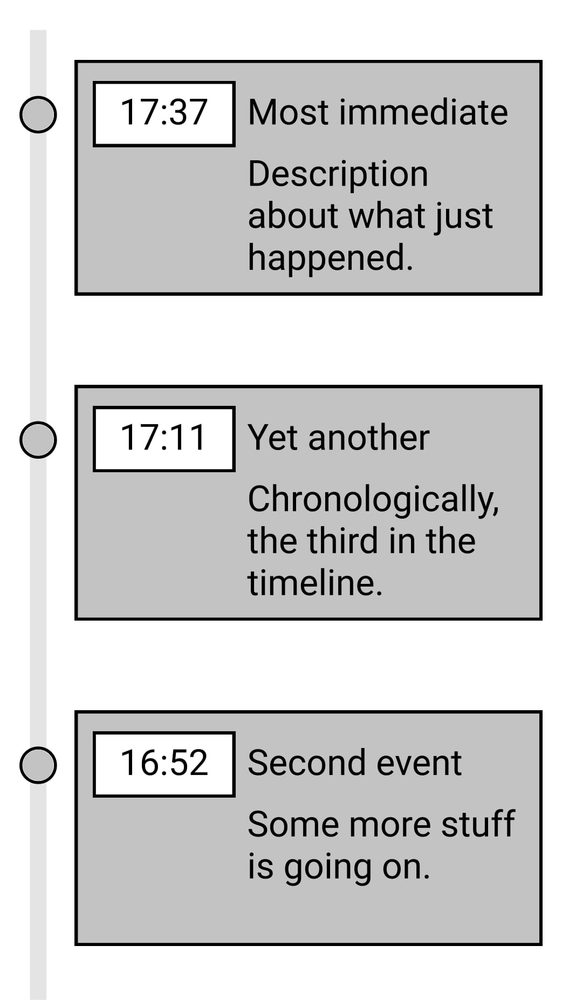

# Create a Timeline component in React

Create a React component that displays a Timeline of events by order of occurance, bottom to top. On Desktop, the events are to be staggered inbetween two branches, whereas on mobile they would collapse to a single branch (see [Wireframes](#the-end-result).)

Every 5 seconds a new event is to be added on top of the Timeline, up to a defined max (say, 5 or 6 elements.) After the cap has been reached, the last event is to be removed also. You can produce events in anyway you like, even re-use them from a predefined array.

Each Event is made of a:

- time
- title
- description

## Constraints

- The component needs to be a React component.
- You can't use any pre-existing component libraries.
- A simple instructable on how to view the example. Dependency `install` and `start` steps, at most.
- Host your solution on Github/Gitlab to share it with us.

## The end result

### Wireframe for Desktop

### Wireframe for Mobile

Coloring and design are up to you. Be creative, add decorations, animations/transitions that you feel would make for a good fit. Take the different aspect ratios into consideration.

## Available Scripts

In the project directory, you can run:

### `yarn start`

Runs the app in the development mode.\
Open [http://localhost:3000](http://localhost:3000) to view it in the browser.

The page will reload if you make edits.\
You will also see any lint errors in the console.

### `yarn test`

Launches the test runner in the interactive watch mode.\
See the section about [running tests](https://facebook.github.io/create-react-app/docs/running-tests) for more information.

### `yarn build`

Builds the app for production to the `build` folder.\
It correctly bundles React in production mode and optimizes the build for the best performance.

The build is minified and the filenames include the hashes.\
Your app is ready to be deployed!

See the section about [deployment](https://facebook.github.io/create-react-app/docs/deployment) for more information.
